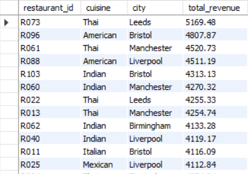
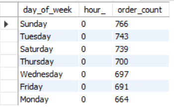
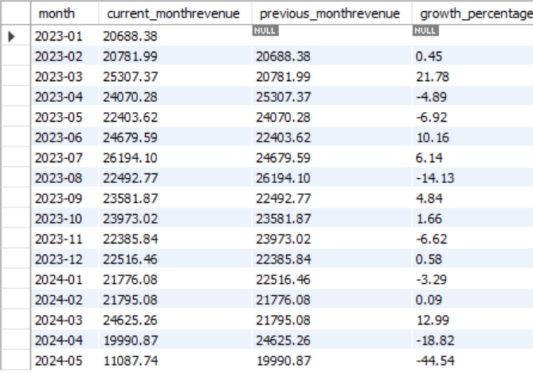
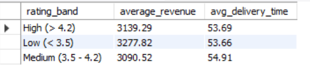

# Food Delivery Analysis with SQL

SQL analysis of a multi-table food delivery dataset (similar to Uber Eats or Deliveroo), covering revenue, customer behavior, delivery performance and trends over time. Written in **MySQL 8.0**.

## Business questions
16 questions from medium to advanced difficulty, covering revenue ranking, customer value, anti-joins, peak-time analysis, delivery performance, ranking within groups, month-over-month growth, running totals and moving averages.

- Full list: [QUESTIONS.md](QUESTIONS.md)
- All queries: [queries.sql](queries.sql)

## Dataset
[SQL Practice Dataset 2 (Medium) + Queries]([https://www.kaggle.com/](https://www.kaggle.com/datasets/nudratabbas/sql-practice-dataset-2-medium-queries/data)) by Nudrat Abbas on Kaggle, licensed **CC BY-NC-SA 4.0**. The CSV files are not included in this repo. download them from Kaggle.

| Table | Columns |
|-------|---------|
| `customers_medium` | customer_id, city, signup_date |
| `restaurants` | restaurant_id, cuisine, city, rating |
| `menu_items` | item_id, restaurant_id, price |
| `orders_medium` | order_id, customer_id, restaurant_id, order_time, delivery_time, status |
| `order_items` | order_id, item_id, quantity, price |

## SQL skills demonstrated
- Multi-table joins 
- Aggregation with `GROUP BY`, `COUNT(DISTINCT ...)`, conditional aggregation
- CTEs and subqueries
- Window functions: `DENSE_RANK`, `LAG`, running totals, moving averages
- Date and time functions: `DATE_FORMAT`, `TIMESTAMPDIFF`, `DAYNAME`, `HOUR`
- Data modeling: a generated column for line-item revenue

## How to run
1. Download the CSVs from Kaggle.
2. In MySQL Workbench, import each CSV into a schema (Table Data Import Wizard) using the table names above.
3. Run `queries.sql` from the top. It starts by adding a `total_amount` column to `order_items`.

## Assumptions
- Revenue = `quantity * price` per order line, excluding `Cancelled` orders.
- Delivery time is measured only for orders with status `Delivered`.
- Check your status values with `SELECT DISTINCT status FROM orders_medium;`

## Key findings
Fill this in after running the queries. Two or three specific numbers make this section stand out.

- Top restaurant by revenue: Restaurant R073	Revenue 5169.48
- Peak ordering window: Sunday (order time not available)
- Month with the strongest growth: 	2023-03	Growth of	21.78%
- Relationship between rating and delivery time: There is no relationship between rating and deliverytime.

### Top

### Peak

### Month growth

### Relationship

